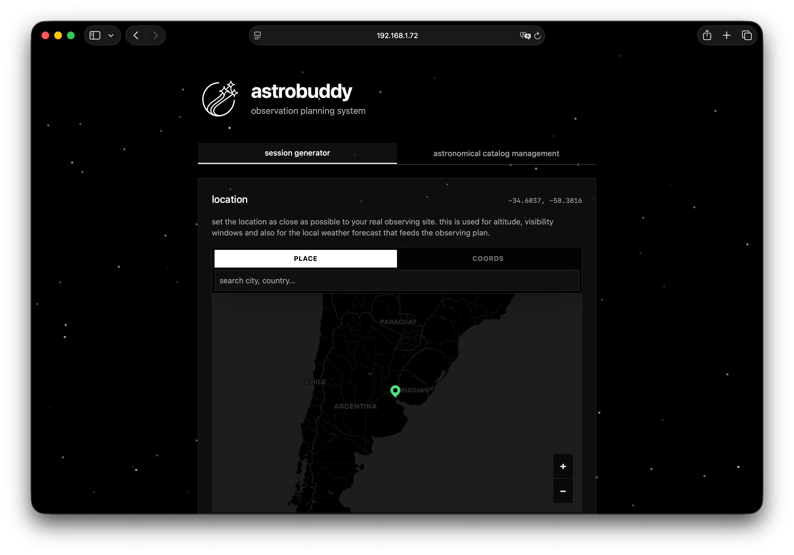

# AstroBuddy

<div align="center">
  
  
  <p><strong>Your intelligent companion for astronomical observation planning</strong></p>
  
  [](https://www.docker.com/)
  [](https://fastapi.tiangolo.com/)
  [](https://svelte.dev/)
  [](https://www.python.org/)
  [](LICENSE)
</div>

---

## 📖 About

**AstroBuddy** is an intelligent astronomical observation planning system that helps amateur astronomers prepare perfect stargazing sessions. By combining real astronomical calculations, weather forecasts, and AI-powered insights, AstroBuddy creates personalized observation plans tailored to your location, equipment, and time.

### ✨ Key Features

- **Astronomical Darkness Window Calculation** - Precise calculation of astronomical twilight times for optimal viewing
- **Equipment-Aware Recommendations** - Suggestions tailored to your telescope specifications
- **Location-Based Planning** - Interactive map selection for accurate coordinates
- **Real-Time Weather Integration** - Hourly weather forecasts including cloud cover and visibility
- **Planetary Visibility** - Automatic calculation of visible planets with rise/set times
- **Deep Sky Object Catalog** - Comprehensive Messier catalog with CRUD management
- **AI-Powered Insights** - Intelligent observation tips powered by OpenAI
- **Visualizations** - Cloud cover indicators and moon phase imagery
- **Professional PDF Reports** - Generate beautiful, printable observation plans
- **Web Report Preview** - View your observation plan in a modern web interface before downloading
- **Session History** - Keep track of past observation sessions

---

## 👨‍💻 Astronomical Technologies & Data Sources

AstroBuddy leverages professional-grade astronomical libraries and databases to provide accurate, scientifically-sound observation planning:

### 🌍 Precise Astronomical Calculations

- **[JPL DE421 Ephemeris](https://naif.jpl.nasa.gov/pub/naif/generic_kernels/spk/planets/)** - NASA's high-precision planetary position data
  - Used for calculating exact positions of planets, Sun, and Moon
  - Accurate ephemeris data from NASA's Jet Propulsion Laboratory
  - Enables sub-arcsecond precision for celestial mechanics

- **[Skyfield](https://rhodesmill.org/skyfield/)** - Professional astronomy engine
  - Calculates rise/set times for celestial objects
  - Computes astronomical, nautical, and civil twilight
  - Determines moon phases and illumination percentages
  - Calculates object visibility windows and transit times
  - Handles proper coordinate transformations (RA/Dec, Alt/Az)

### 📚 Astronomical Catalogs

- **Messier Catalog** - 110 deep-sky objects for amateur observation
  - Galaxies, nebulae, star clusters, and remnants
  - Pre-loaded database with positions, magnitudes, sizes, and descriptions
  - Historical catalog curated for visual observing

- **[Astroquery](https://astroquery.readthedocs.io/)** - Professional astronomical database queries
  - **SIMBAD Integration** - Query the astronomical database (CDS, Strasbourg) for object data
  - **VizieR Integration** - Access thousands of astronomical catalogs
  - Automatic object lookup for enriching catalog entries
  - Real-time data retrieval from professional observatories

- **Extensible Catalog System**
  - Support for NGC (New General Catalogue)
  - Support for IC (Index Catalogue)
  - Custom object additions with full CRUD operations
  - Search and filter capabilities across all catalogs

### 🤖 AI-Powered Analysis

- **[OpenAI GPT Models](https://openai.com/)** - Intelligent observation planning
  - Analyzes weather conditions and astronomical data
  - Curates personalized object recommendations based on equipment
  - Generates technical yet passionate descriptions for each target
  - Provides observation tips (filters, magnification, techniques)
  - Multi-language support (English, Spanish)
  - Combines scientific accuracy with engaging storytelling

### ☁️ Meteorological Data

- **[Open-Meteo API](https://open-meteo.com/)** - Professional weather forecasting
  - Hour-by-hour weather predictions during darkness windows
  - Cloud cover percentage (critical for observing)
  - Temperature, humidity, and visibility metrics
  - Precipitation forecasts
  - Optimized for astronomical observation planning

---

## 💻 Tech Stack

**Backend:** FastAPI, Python 3.9+, Skyfield, Astropy, Astroquery, OpenAI SDK, Pandas  
**Frontend:** SvelteKit, TypeScript, Tailwind CSS, Shad/CN  
**Infrastructure:** Docker, Docker Compose

---

## Installation & Setup

### Prerequisites

- Docker and Docker Compose installed
- OpenAI API key (for AI insights feature)

### Quick Start

1. **Clone the repository**

   ```bash
   git clone https://github.com/TOMIVERGARA/astrobuddy.git
   cd astrobuddy
   ```

2. **Set up environment variables**

   Create a `.env` file in the `backend` directory:

   ```bash
   OPENAI_API_KEY=your_openai_api_key_here
   ```

3. **Run with Docker Compose**

   ```bash
   docker-compose up --build
   ```

4. **Access the application**
   - Frontend: http://localhost:5173
   - Backend API: http://localhost:8000

---

## 📱 Usage

1. **Select Your Location**
   - Use the interactive map or enter coordinates manually
   - Search for your city or observing site

2. **Choose Observation Date**
   - Pick any date for your planned observation session

3. **Enter Telescope Details**
   - Describe your equipment (e.g., "8 inch Dobsonian", "4 inch refractor")

4. **Generate Your Plan**
   - Click "Generate Plan" and watch the magic happen
   - AI analyzes astronomical conditions, weather, and equipment

5. **Review Your Personalized Report**
   - View the web-based report with all details
   - See recommended objects, planetary positions, and weather forecast
   - Download a professional PDF for offline use

6. **Manage Celestial Objects**
   - Browse the astronomical catalog
   - Add, edit, or remove celestial objects
   - Search for specific targets

---

## Contact

For questions, suggestions, or feedback, please open an issue on GitHub.
Please note that AstroBuddy is a personal project developed intermittently in my spare time. It is not my primary occupation, so updates and responses might not be immediate.

---

## License

This project is licensed under the **Creative Commons Attribution-NonCommercial 4.0 International (CC BY-NC 4.0)**.

You are free to:

- **Share** — copy and redistribute the material in any medium or format
- **Adapt** — remix, transform, and build upon the material

Under the following terms:

- **Attribution** — You must give appropriate credit, provide a link to the license, and indicate if changes were made.
- **NonCommercial** — You may not use the material for commercial purposes.

See the [LICENSE](LICENSE) file for details.

---

<div align="center">
  <p>Made with passion for the astronomy community</p>
  <p>Clear skies! 🌠</p>
</div>
